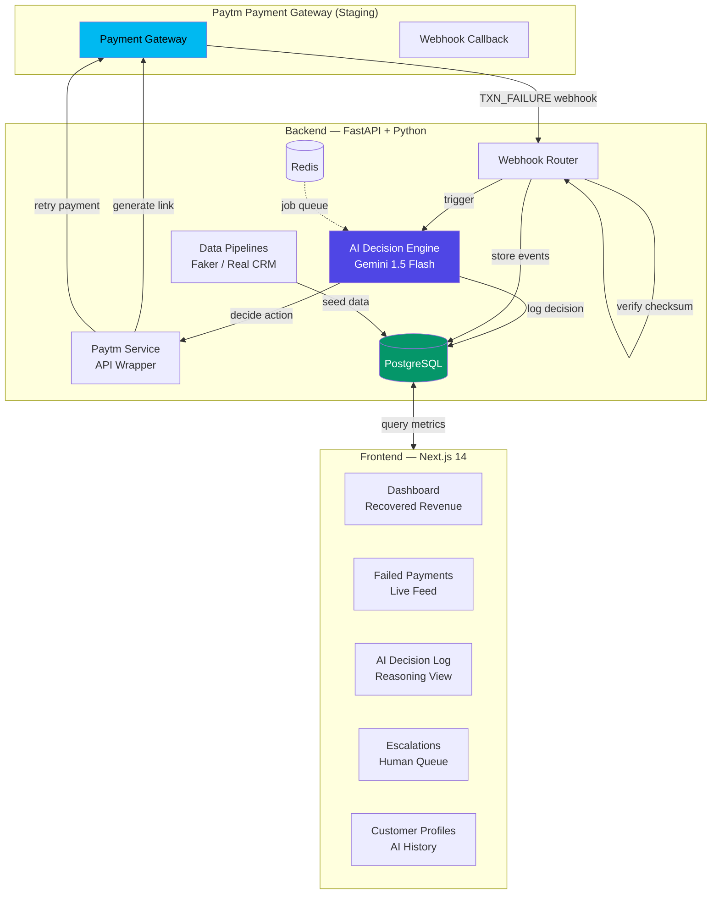

# AI Collections & Retention Agent
### Paytm Hackathon — Autonomous AI Teammates Track

> An autonomous AI teammate that recovers failed Paytm payments and prevents subscription churn. It detects failures via webhooks, analyzes customer context using **Google Gemini 1.5 Flash**, decides on a recovery strategy, executes Paytm API actions, and escalates to humans only when necessary.

---

## Architecture



---

## Project Structure

```
ai-collections-agent/
├── backend/
│   ├── app/
│   │   ├── main.py                    # FastAPI entry point
│   │   ├── config.py                  # Env var loader (pydantic-settings)
│   │   ├── database.py                # SQLAlchemy async setup
│   │   ├── models/
│   │   │   ├── customer.py            # Customer ORM model
│   │   │   ├── payment.py             # Payment ORM model + PaymentStatus enum
│   │   │   └── ai_action.py           # AIAction model + ActionType enum
│   │   ├── schemas/
│   │   │   └── __init__.py            # All Pydantic schemas
│   │   ├── routes/
│   │   │   ├── webhooks.py            # POST /webhooks/paytm
│   │   │   ├── ai_agent.py            # POST /api/ai/trigger/{id}
│   │   │   ├── customers.py           # GET/POST /api/customers/
│   │   │   └── dashboard.py          # GET /api/dashboard/*
│   │   ├── services/
│   │   │   ├── paytm_service.py       # Paytm Staging API wrapper
│   │   │   ├── ai_decision_engine.py  # Gemini + decision logic
│   │   │   └── escalation_service.py  # Human handoff
│   │   ├── pipelines/                 # ⭐ DATA PIPELINE SPACE
│   │   │   ├── generate_synthetic.py  # Faker-based data generator
│   │   │   ├── ingest_customers.py    # Customer data loader
│   │   │   └── ingest_payments.py     # Payment event loader
│   │   └── utils/
│   │       ├── paytm_checksum.py      # Checksum gen/verify
│   │       └── logger.py              # Structured logging
│   ├── requirements.txt
│   ├── Dockerfile
│   └── .env.example
├── frontend/
│   ├── app/
│   │   ├── page.tsx                   # Dashboard — Recovered Revenue
│   │   ├── failed-payments/page.tsx   # Live failed payment feed
│   │   ├── ai-log/page.tsx            # AI decision chronology
│   │   ├── escalations/page.tsx       # Human escalation queue
│   │   └── customers/
│   │       ├── page.tsx               # Customer list
│   │       └── [id]/page.tsx          # Customer detail
│   ├── components/
│   │   ├── Sidebar.tsx
│   │   ├── RevenueChart.tsx           # Recharts area chart
│   │   ├── DecisionCard.tsx           # AI decision card
│   │   └── EscalationTable.tsx        # Escalation queue table
│   ├── lib/api.ts                     # Typed API client + mock data
│   └── .env.local.example
├── scripts/
│   └── simulate_failure.py            # 🔥 Demo: fires fake webhook
├── docker-compose.yml
└── README.md
```

---

## Setup Instructions

### Prerequisites
- Docker & Docker Compose
- Python 3.11+ (for manual setup)
- Node.js 20+ (for manual setup)
- A [Paytm Test Account](https://developer.paytm.com/docs/testing/) (MID + Merchant Key)
- A [Google AI Studio](https://makersuite.google.com/app/apikey) Gemini API Key

---

### Option 1: Docker Compose (Recommended)

```bash
# 1. Clone and enter the project
cd ai-collections-agent

# 2. Set up environment variables
cp backend/.env.example backend/.env
# Edit backend/.env with your PAYTM_MID, PAYTM_MERCHANT_KEY, GEMINI_API_KEY

cp frontend/.env.local.example frontend/.env.local

# 3. Start all services
docker compose up --build

# 4. In a separate terminal, seed the database
docker compose exec backend python -m app.pipelines.generate_synthetic
docker compose exec backend python -m app.pipelines.ingest_customers
docker compose exec backend python -m app.pipelines.ingest_payments
```

Open **http://localhost:3000** for the dashboard.
Open **http://localhost:8000/docs** for the API explorer.

---

### Option 2: Manual Setup

#### Backend
```bash
cd backend

# Create virtual environment
python -m venv .venv
source .venv/bin/activate  # Windows: .venv\Scripts\activate

# Install dependencies
pip install -r requirements.txt

# Environment setup
cp .env.example .env
# Edit .env with your API keys

# Start PostgreSQL and Redis (required)
# Using Homebrew:  brew services start postgresql redis
# Or Docker:       docker run -d -p 5432:5432 -e POSTGRES_PASSWORD=aiagent123 postgres:16-alpine
#                  docker run -d -p 6379:6379 redis:7-alpine

# Start the backend
uvicorn app.main:app --reload --host 0.0.0.0 --port 8000
```

#### Seed Database
```bash
# In backend/ with virtualenv active
python -m app.pipelines.generate_synthetic   # Creates JSON files in /data
python -m app.pipelines.ingest_customers     # Loads customers into DB
python -m app.pipelines.ingest_payments      # Loads payment events into DB
```

#### Frontend
```bash
cd frontend
cp .env.local.example .env.local
npm install
npm run dev
```

---

## Paytm API Integration

All Paytm calls use **STAGING (WEBSTAGING)** — no real money moves.

| Feature | Endpoint | Method |
|---|---|---|
| Webhook Receiver | `POST /webhooks/paytm` | Receives form-encoded callbacks |
| Generate Payment Link | `https://securegw-stage.paytm.in/theia/api/v1/generateLink` | POST |
| Check Txn Status | `https://securegw-stage.paytm.in/order/status` | POST |
| Initiate Refund | `https://securegw-stage.paytm.in/v2/process/refund/initiatePayout` | POST |

**Checksum verification** uses the official `paytmchecksum` library on every incoming webhook and outgoing API request.

---

## AI Decision Engine

```
Customer LTV > ₹5,000 AND retries < 2  → SEND_LINK      (personalized payment link)
Customer LTV > ₹5,000 AND retries ≥ 2  → OFFER_DISCOUNT (10% discount)
Customer LTV ≤ ₹5,000 AND retries < 3  → RETRY          (auto-retry)
Any customer AND retries ≥ 3           → ESCALATE       (human review)
```

Gemini 1.5 Flash receives the customer profile, payment context, and decision, then generates a 2-3 sentence reasoning explaining **why** this action was chosen and how to personalize it.

---

## Running the Demo

### Quick Demo (3 minutes)

```bash
# Step 1: Ensure services are running
docker compose up -d

# Step 2: Open dashboard
open http://localhost:3000

# Step 3: Fire a fake payment failure
python scripts/simulate_failure.py \
  --order-id DEMO_001 \
  --amount 4999 \
  --customer-id 1

# Step 4: Watch the AI log at http://localhost:3000/ai-log
# The AI will decide: SEND_LINK (high LTV customer, < 2 retries)

# Step 5: Simulate an escalation (retry count ≥ 3)
python scripts/simulate_failure.py \
  --amount 1499 \
  --customer-id 5

# Repeat 3 more times for same customer to trigger ESCALATE

# Step 6: Show escalation queue at http://localhost:3000/escalations
# Click "Mark as Resolved" to demonstrate human handoff

# Step 7: Show recovery chart at http://localhost:3000
# Recovery trend updates in real-time (polls every 5s)
```

---

## Data Pipeline — Integration Guide

The `backend/app/pipelines/` folder is designed for easy replacement with real data:

### Replacing with Real Customer Data (CRM)
```python
# In ingest_customers.py, replace:
DEFAULT_SOURCE = "backend/data/customers.json"  # ← change this

# With:
DEFAULT_SOURCE = "https://your-crm.example.com/api/customers"

# And update SCHEMA_MAP to match your CRM's field names:
CUSTOMER_SCHEMA_MAP = {
    "customerIdentifier": "id",      # your field → our field
    "fullName": "name",
    "emailAddress": "email",
    ...
}
```

### Replacing with Real Paytm Transaction Sync
```python
# In ingest_payments.py, replace:
DEFAULT_SOURCE = "backend/data/payments.json"  # ← change this

# With Paytm Bulk Transaction API or Kafka stream
DEFAULT_SOURCE = "https://securegw.paytm.in/v3/order/bulkQuery"
```

### Generating Fresh Synthetic Data
```bash
python -m app.pipelines.generate_synthetic
# Creates 50 customers + 200 payments with 20% failure rate
```

---

## API Reference

| Method | Endpoint | Description |
|---|---|---|
| GET | `/api/dashboard/metrics` | KPIs: recovered, rate, active, escalations |
| GET | `/api/dashboard/recovery-trend` | 7-day chart data |
| GET | `/api/dashboard/failed-payments` | Paginated failed payments |
| GET | `/api/dashboard/ai-actions` | Paginated AI decisions |
| GET | `/api/dashboard/escalations` | Open escalation queue |
| POST | `/api/ai/trigger/{payment_id}` | Manually trigger AI decision |
| POST | `/api/ai/escalations/{id}/resolve` | Mark escalation resolved |
| GET | `/api/customers/` | List all customers |
| GET | `/api/customers/{id}` | Customer detail + history |
| POST | `/webhooks/paytm` | Paytm webhook receiver |

---

## 3-Minute Demo Script

```
[0:00] Open http://localhost:3000
"This is our AI Collections Agent dashboard. It autonomously recovers 
failed Paytm payments using Google Gemini AI."

[0:20] Point to metric cards
"We've recovered ₹2.47 lakhs with a 68% recovery rate. The AI is 
handling 23 active cases right now, with only 4 escalated to humans."

[0:40] Run: python scripts/simulate_failure.py --amount 4999 --customer-id 1
"Watch what happens when a payment fails. I'll fire a real Paytm-style 
webhook right now."

[1:00] Switch to /ai-log
"In under a second, Gemini analyzed the customer — high LTV of ₹48,500, 
first retry — and decided to SEND_LINK. Here's the exact reasoning 
it generated."

[1:20] Switch to /failed-payments, click a row
"Every failed payment has an AI status. I can also manually trigger 
the AI from here. Click 'Trigger AI Decision Now'."

[1:40] Switch to /escalations
"These are the cases where AI exhausted all options. A human needs 
to step in. Click 'Mark as Resolved' to close it."

[2:00] Switch back to dashboard, show chart
"The recovery trend chart updates every 5 seconds. As the AI works, 
you see the green line rise — that's real recovered revenue."

[2:20] Show /customers/1
"Every customer has a full profile: LTV, churn risk score, payment 
history, and every AI decision ever made for them."

[2:45] Show backend docs at localhost:8000/docs
"The entire backend is documented with FastAPI's Swagger UI. 
We use Paytm Staging — zero real money, fully testable."

[3:00] Wrap up
"This is a complete, production-ready autonomous AI teammate: 
Paytm webhooks → Gemini reasoning → Paytm API execution → 
Human escalation only when needed."
```
